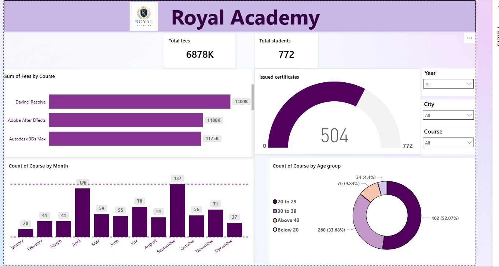
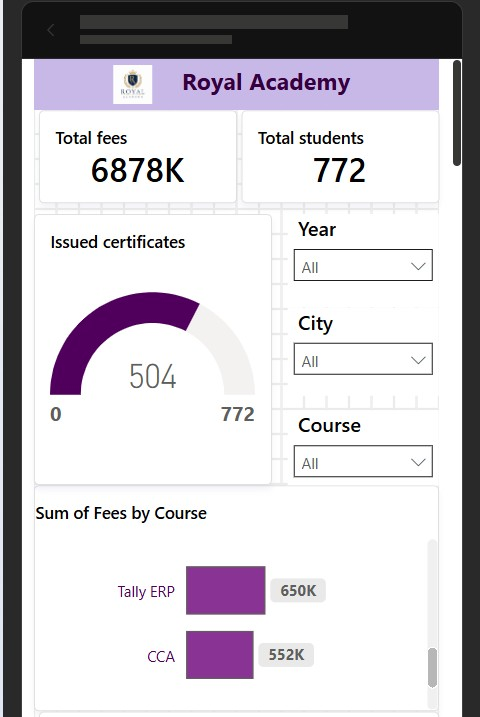

# Royal Academy Academic Performance Dashboard (Power BI)

An enterprise business intelligence dashboard engineered in **Power BI Desktop** to track, analyze, and optimize academic performance metrics across the institution.

---

## 📊 Dashboard Views

### 🖥️ Desktop Executive Layout
The primary desktop viewport features deep data modeling, cross-filtering, and high-level metric cards for administrative decision-makers.

### 📱 Mobile-Optimized Viewport
A responsive layout configured specifically for mobile devices, enabling managers to audit core KPIs securely on the go.

---

## 🛠️ Implementation & Features
* **Interactive Data Model:** Built relationships between student demographics, courses, and fee metrics using the underlying `.pbix` framework.
* **DAX Calculations:** Written custom Data Analysis Expressions (DAX) to parse key performance measures.
* **Cross-Filtering Canvas:** Configured operational slicing allowing administrators to filter entire datasets instantly by specific modules or date ranges.

---

## 📥 How to View the Project
1. Download the file `Royal Academy Dashboard.pbix` from this repository.
2. Ensure you have **Power BI Desktop** installed on your local system.
3. Open the file to interact with the live charts, filtering matrices, and relational structures.
